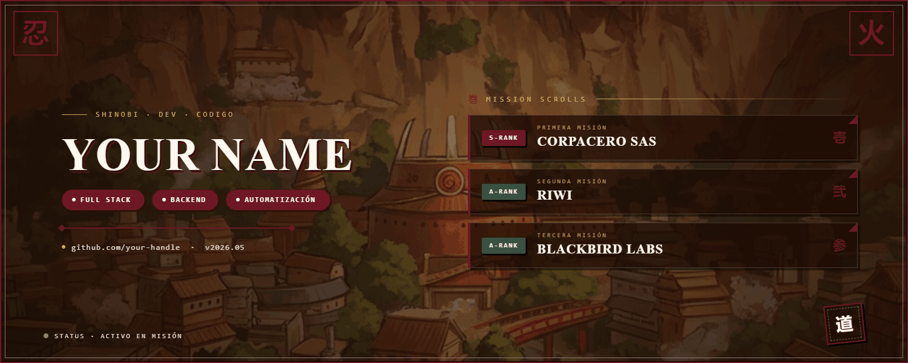
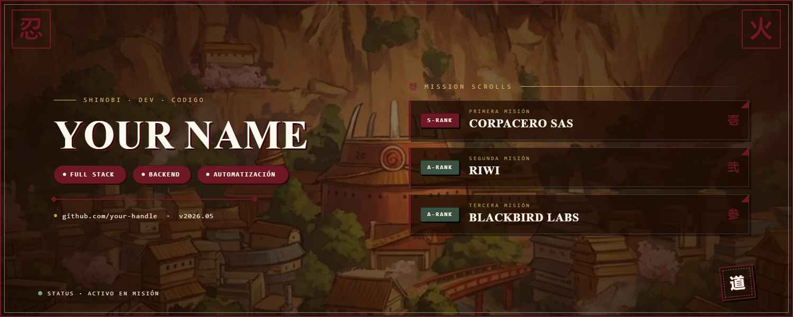

# 👋 ¡Hola!

  

<!--
Alternativa con JPG (más liviano):

Alternativa con URL absoluta (cambia <usuario>/<repo>/<rama>):
/<repo>/main/Banner.png" alt="Banner" width="100%"/>
-->

## Sobre mí

- 🔧 Full-stack · Backend · Automatización
- 📍 Misiones recientes: Corpacero SAS · Riwi · Blackbird Labs
- 📫 Contacto: [tu-email@example.com](mailto:tu-email@example.com)
